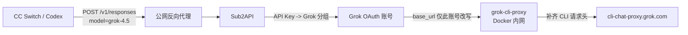

# Sub2API 接入 Grok Build OAuth Responses 的运行手册

> 本文说明如何把本项目生成的 Grok Build / CLI OAuth 账号接入 Sub2API，
> 并解释当前版本需要兼容代理时的边界、验证和回滚方法。真实域名、账号 ID、
> API Key、OAuth token、数据库容器名和备份路径必须记录在本机 `private/`，
> 不得写入可提交文档。

## 1. 结论

本项目导出的 OAuth 账号使用 Grok Build / CLI 通道：

```text
https://cli-chat-proxy.grok.com/v1/responses
```

该通道不是 `api.x.ai` 的付费 API Key 通道。请求除 Bearer token 外还需要
官方 Grok CLI 客户端标识：

```text
User-Agent: grok-cli/0.2.93
X-XAI-Token-Auth: xai-grok-cli
x-grok-client-version: 0.2.93
x-grok-client-identifier: grok-shell
```

如果当前 Sub2API 版本没有原生发送这些请求头，同时又不允许修改 Sub2API
源码，可以增加一个仅 Docker 内网可见的 Nginx sidecar：Sub2API 仍负责分组、
鉴权、OAuth token 刷新、模型映射、计费和 Responses 协议；sidecar 只补请求头，
然后把请求转发到固定的 Grok CLI 上游。

这是兼容方案，不是 Sub2API 自带的 Grok 代理配置功能。

## 2. 两层故障及其区别

### 2.1 `404 model_not_found` 或 `no available accounts`

典型配置：

```text
API Key -> platform=openai 的分组
Grok OAuth 账号 -> platform=grok
```

Sub2API 先根据 API Key 所属分组确定平台，再从该平台的账号池中筛选模型。
它不是先按模型跨平台寻找账号。因此即使 Grok 账号的 `model_mapping` 包含
`grok-4.5`，放在 OpenAI 分组中仍会先被平台过滤，最终返回 404。

处理方法：

1. 创建独立 `platform=grok` 分组。
2. 将 Grok OAuth 账号只绑定到该分组。
3. 创建专用 API Key，并绑定到该 Grok 分组。
4. 客户端使用该 Key 请求 `POST /v1/responses`。

这一步只解决本地调度。若日志中没有 `account_id=<grok-account>`，说明请求尚未
到达 Grok 上游。

### 2.2 路由成功后上游返回 `402`

如果日志已经显示：

```text
provider=grok
account_id=<grok-account>
upstream_status=402
```

说明分组和模型路由已经正确，问题发生在 Grok 上游。

本项目生成的账号属于 CLI OAuth 通道。使用同一 access token 做对照测试：

- 只有 Bearer token、普通 User-Agent：可能返回 402。
- 加上 Grok CLI User-Agent 和三个 CLI 头：应返回 200，或返回真实额度/授权错误。

只有完成这个 A/B 对照，才能把问题归因为请求头缺失，不能仅凭 402 猜测账号
没有额度。

## 3. 完整请求流



职责边界：

| 组件 | 职责 |
|---|---|
| 客户端 | 发送标准 OpenAI Responses 请求 |
| Sub2API | API Key、分组调度、模型映射、OAuth 刷新、计费和响应转发 |
| `grok-cli-proxy` | 保留 Authorization，覆盖 CLI User-Agent，注入三个 CLI 头 |
| Grok CLI 上游 | 实际模型推理和额度判定 |

代理不生成、不刷新、不保存 OAuth token。Bearer token 只随单次请求从 Sub2API
传递到固定上游。

## 4. 隔离范围

代理不是全局流量入口。只有满足以下条件的账号会经过它：

```text
credentials.base_url = http://grok-cli-proxy:8080/v1
```

因此正常运行时：

- OpenAI、Anthropic、Gemini 等分组不经过该代理。
- 其他未改写 `base_url` 的 Grok 账号也不经过该代理。
- 代理故障只会使指向它的 Grok 账号请求失败。
- 代理没有宿主机 `ports` 映射，只能从同一 Docker 网络访问。

有一个启动期例外：如果 Sub2API 配置了
`depends_on: grok-cli-proxy: condition: service_healthy`，整套 Compose 冷启动或
重建时会等待代理健康。代理配置错误可能阻止主 Sub2API 启动，从而间接影响
所有分组。主服务已经运行后，代理崩溃不会自动停止 Sub2API。

## 5. Sub2API 逻辑配置

推荐分组：

```text
name: grok
platform: grok
status: active
subscription_type: standard
is_exclusive: true
require_oauth_only: true
rate_multiplier: 1
```

账号要求：

```text
platform: grok
type: oauth
status: active
schedulable: true
model_mapping: {"grok-4.5":"grok-4.5"}
group_ids: [<grok-group-id>]
```

API Key 推荐使用独立名称，例如 `codex-grok`。独占分组下，先创建未绑定 Key，
再通过管理员 API 将 Key 绑定到分组，可以让 Sub2API 同步授予该用户的分组权限。

客户端配置：

```text
Base URL: https://<sub2api-domain>/v1
API Key: <grok-group-api-key>
Model: grok-4.5
API type: Responses
```

不要把真实 Key 写入本文、README、Issue、Git 提交或命令示例。

## 6. 为什么数据库 Header 字段不够

本项目的 CLIProxyAPI auth JSON 会导出 `headers` 字段。但是否使用这些字段由
消费方决定。某些 Sub2API 版本的 Grok Responses 请求构造只设置：

```text
Authorization
Content-Type
Accept
User-Agent: sub2api-grok/1.0
```

即使数据库 credentials 中保存了 `headers`，这条 Grok Responses 路径也可能
不调用通用 Header override 逻辑。此时只改数据库不能补齐 CLI 头，必须升级、
修改源码，或使用本文的 sidecar 兼容层。

## 7. Compose 接入

以下片段加入 Sub2API 的 Compose。代理没有宿主机端口映射：

```yaml
services:
  sub2api:
    depends_on:
      grok-cli-proxy:
        condition: service_healthy
    environment:
      XAI_ALLOW_UNSAFE_URL_OVERRIDES: "true"

  grok-cli-proxy:
    image: nginx:1.27-alpine
    restart: unless-stopped
    volumes:
      - ./grok-cli-proxy.conf:/etc/nginx/nginx.conf:ro
    tmpfs:
      - /var/cache/nginx
      - /var/run
    healthcheck:
      test: ["CMD", "wget", "-q", "-T", "5", "-O", "/dev/null", "http://127.0.0.1:8080/healthz"]
      interval: 10s
      timeout: 5s
      retries: 5
      start_period: 5s
```

`XAI_ALLOW_UNSAFE_URL_OVERRIDES=true` 是必要的兼容例外，因为默认 xAI URL
校验只允许官方 HTTPS 主机，而 sidecar 使用 Docker 私网 HTTP 地址。

该变量只改变 Sub2API 的 xAI/Grok URL 校验，不会把 OpenAI/Anthropic 请求改道。
但它允许管理员为 Grok/xAI 设置 HTTP 或私网 URL，扩大了 SSRF 配置面：

- 只有受信任管理员才能编辑 Grok 账号和 OAuth endpoint。
- 不要把 Sub2API 管理接口暴露给不受信任用户。
- 新增 Grok 账号时必须审查 `base_url`、token endpoint 和 authorize endpoint。
- 原生兼容完成后应删除该环境变量。

修改环境变量需要重建 Sub2API 容器。单实例部署会产生短暂连接中断，应先备份、
验证 Compose，并选择可接受的发布窗口。

## 8. Nginx 头注入配置

`grok-cli-proxy.conf`：

```nginx
events {}

http {
    resolver 127.0.0.11 ipv6=off valid=300s;

    server {
        listen 8080;

        location = /healthz {
            access_log off;
            default_type text/plain;
            return 200 "ok\n";
        }

        location / {
            set $grok_upstream https://cli-chat-proxy.grok.com;

            proxy_pass $grok_upstream$request_uri;
            proxy_http_version 1.1;
            proxy_ssl_server_name on;
            proxy_ssl_name cli-chat-proxy.grok.com;
            proxy_set_header Host cli-chat-proxy.grok.com;
            proxy_set_header Authorization $http_authorization;
            proxy_set_header User-Agent grok-cli/0.2.93;
            proxy_set_header X-XAI-Token-Auth xai-grok-cli;
            proxy_set_header x-grok-client-version 0.2.93;
            proxy_set_header x-grok-client-identifier grok-shell;
            proxy_buffering off;
            proxy_read_timeout 600s;
            proxy_send_timeout 600s;
        }
    }
}
```

关键点：

- 上游主机固定为 `cli-chat-proxy.grok.com`，客户端不能通过路径选择其他主机。
- `$request_uri` 原样保留 `/v1/responses` 等路径。
- `proxy_ssl_server_name` 和 `proxy_ssl_name` 保证上游 TLS SNI 正确。
- `proxy_buffering off` 避免破坏 Responses SSE 流式输出。
- 默认 access log 不记录 Authorization 和请求体，但会记录路径、状态和 UA。
- `/healthz` 只验证 Nginx 本地可用，不验证上游 DNS、TLS、授权或额度。

本文已实际验证 `/v1/responses`。即使代理会转发其他路径，也不能据此声称
Grok CLI 上游支持所有 Chat、图片、视频或管理端点；每个端点必须单独验证。

## 9. 发布顺序

1. 备份与分组、账号、Key 相关的数据库表。
2. 创建独立 Grok 分组。
3. 将 Grok 账号替换绑定到新分组。
4. 创建专用 API Key，并绑定 Grok 分组。
5. 添加并启动 `grok-cli-proxy`，等待健康检查通过。
6. 先从 Sub2API 容器内请求 sidecar，验证返回 200。
7. 校验 Compose，重建 Sub2API 以加载 `XAI_ALLOW_UNSAFE_URL_OVERRIDES`。
8. 将目标 Grok 账号的 `credentials.base_url` 改为
   `http://grok-cli-proxy:8080/v1`。
9. 等待 scheduler outbox 水位消费完成。
10. 通过公网 Base URL 做非流式和流式 Responses 双验证。

不要先改账号 `base_url` 再启动代理，否则请求会立即失败。

## 10. 验证

### 10.1 模型列表

```bash
curl -sS https://<sub2api-domain>/v1/models \
  -H 'Authorization: Bearer <grok-group-api-key>'
```

应包含：

```json
{"id":"grok-4.5"}
```

### 10.2 非流式 Responses

```bash
curl -sS https://<sub2api-domain>/v1/responses \
  -H 'Authorization: Bearer <grok-group-api-key>' \
  -H 'Content-Type: application/json' \
  -d '{
    "model":"grok-4.5",
    "input":"Reply exactly: OK",
    "max_output_tokens":8,
    "store":false
  }'
```

验收条件：

- HTTP 200
- `status=completed`
- 请求模型为 `grok-4.5`
- 上游可能报告实际模型 `grok-4.5-build-free`
- 输出包含 `OK`

### 10.3 流式 Responses

```bash
curl -sS -N https://<sub2api-domain>/v1/responses \
  -H 'Authorization: Bearer <grok-group-api-key>' \
  -H 'Content-Type: application/json' \
  -d '{
    "model":"grok-4.5",
    "input":"Reply exactly: OK",
    "max_output_tokens":8,
    "store":false,
    "stream":true
  }'
```

验收条件：HTTP 200，出现 `response.output_text.delta` 和
`response.completed` 事件。

## 11. 错误判读

| 现象 | 所在层 | 优先检查 |
|---|---|---|
| 404，未出现 Grok account ID | Sub2API 调度 | API Key 分组平台、账号绑定、模型映射 |
| `/v1/models` 有模型，但 Responses 402 | Grok 上游请求形态 | CLI User-Agent 和三个 CLI 头 |
| 401 | OAuth token | token 是否过期、刷新是否成功、scope |
| 403 | entitlement | `grok-cli:access`、账号资格、订阅或风控 |
| 429 | 额度/限流 | quota headers、retry-after、账号冷却 |
| 502 且日志显示 upstream 402/403 | Sub2API 错误包装 | 查看 ops error 的真实 upstream status |
| 502/连接拒绝，只有该账号失败 | sidecar | 容器健康、Docker DNS、Nginx 日志 |
| 冷启动时 Sub2API 未启动 | Compose 依赖 | sidecar healthcheck 和 Nginx 配置 |

## 12. 备份和产物

一次受控接入通常会产生：

- 一个相关数据库表的发布前备份。
- 一处 Compose 修改。
- 一个 `grok-cli-proxy.conf`。
- 一个 Nginx sidecar 容器。
- 一个 Docker 镜像。
- 一个 Grok 分组、账号绑定、用户分组权限和专用 API Key。

这些是运行所需状态，不是临时垃圾。命令中的响应临时文件和临时 JWT 应在验证
完成后删除或自然失效；不得按文件名、时间或扩展名清理归属不明的 `/tmp` 文件。

部署目录是否需要提交由它自身是否为 Git 仓库决定。服务器本地 Compose 目录
如果不是 Git 仓库，就不会自动进入源码提交；应由独立的配置备份或运维系统负责。

## 13. 回滚

先确认回滚目标、备份和允许的中断窗口。推荐顺序：

1. 停止客户端使用 Grok 专用 Key。
2. 将 Grok 账号 `base_url` 改回
   `https://cli-chat-proxy.grok.com/v1`。
3. 验证 scheduler outbox 已消费账号变更。
4. 从 Compose 删除 `XAI_ALLOW_UNSAFE_URL_OVERRIDES`、sidecar 和
   `depends_on`。
5. 重建 Sub2API，确认其他分组健康。
6. 删除 sidecar 容器和配置；镜像只在确认无其他容器使用后删除。
7. 如果同时撤销整个 Grok 接入，再删除专用 Key、用户分组权限和新分组，
   并按需要恢复原账号绑定。

仅执行第 2 至 6 步会恢复到“无代理但 CLI 请求头仍缺失”的状态，Responses 可能
重新返回 402。因此只有原生请求头支持已经上线，或明确接受 Grok 暂不可用时，
才能移除代理。

## 14. 长期方案

长期方案不一定要求立即自行修改源码，可以是：

1. 升级到已经原生支持 Grok CLI OAuth 请求头的 Sub2API 版本。
2. 在自维护 Sub2API 中修改 Grok 请求构造，为 CLI base URL 原生设置所需请求头。
3. 改用官方 `api.x.ai` API Key 通道，不再使用 CLI OAuth endpoint。

采用方案 1 或 2 时，应同时覆盖实际使用的 Responses 路径；如果还使用
Chat Completions、quota、图片或视频路径，也要分别验证，不能只修一个请求构造器。

原生兼容验收完成后：

- 账号 `base_url` 恢复官方 CLI URL。
- 删除 sidecar。
- 删除 `XAI_ALLOW_UNSAFE_URL_OVERRIDES`。
- 删除 Compose 启动依赖。
- 再做公网流式和非流式双验证。

